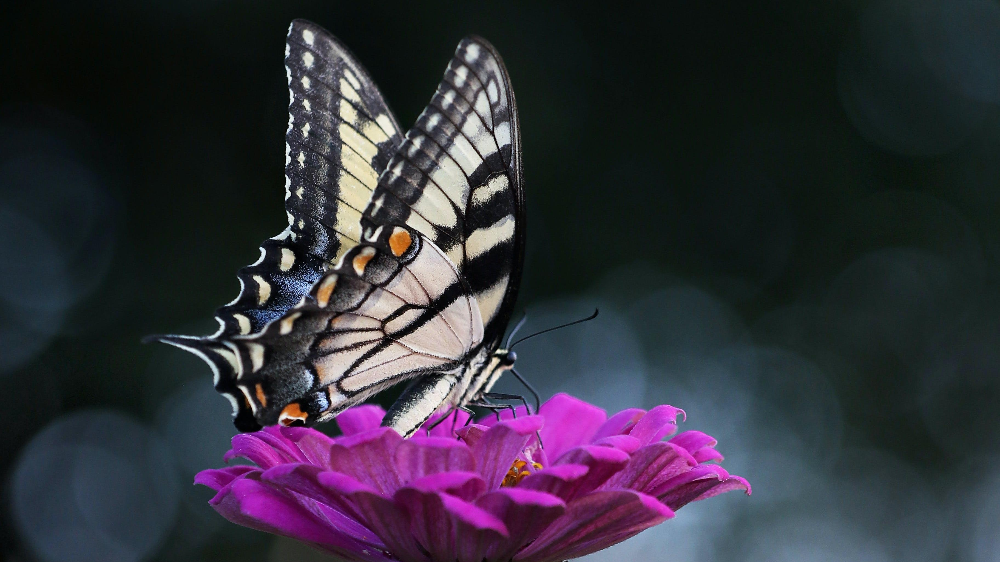
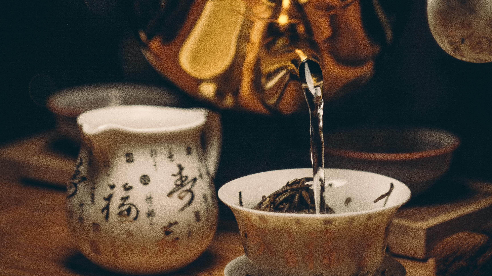
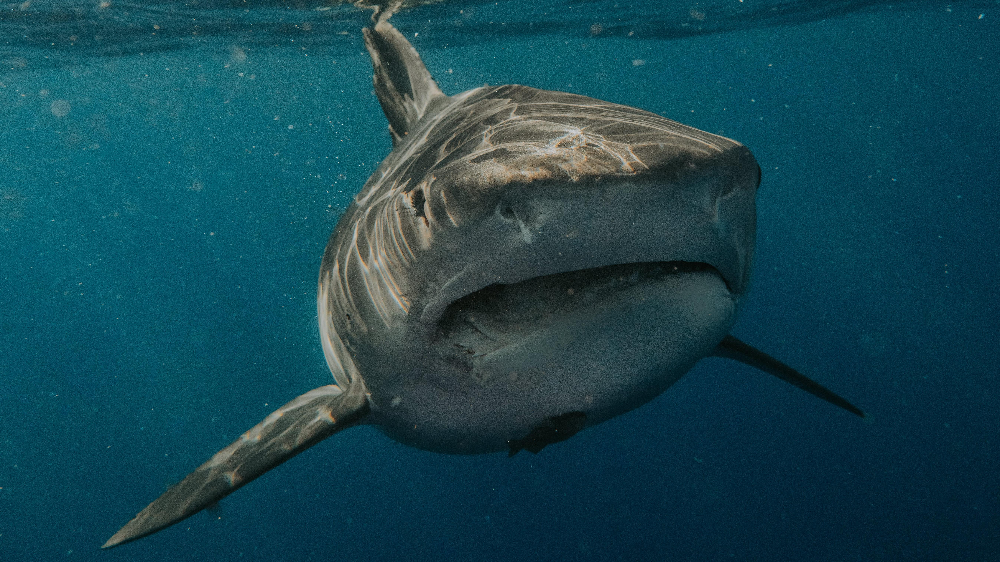

# VCUT Project

## Visual Results

### Input Images and Videos

| Input Image | Original Video | Processed Video: SVD | Processed Video: SVD + VCUT |
|-------------|----------------|----------------------|-----------------------------|
|  | [Original](contents/a_butterfly_sits_on_top_of_a_purple_flower_2_original_14frame.mp4) | [SVD](contents/a_butterfly_sits_on_top_of_a_purple_flower_2_vcut17_14frame.mp4) | [SVD + VCUT](contents/a_butterfly_sits_on_top_of_a_purple_flower_2_vcut17_14frame.mp4) |
|  | [Original](contents/a_person_is_pouring_water_into_a_teacup_0_original.mp4) | [SVD](contents/a_person_is_pouring_water_into_a_teacup_0_vcut17_14frame.mp4) | [SVD + VCUT](contents/a_person_is_pouring_water_into_a_teacup_0_vcut17_14frame.mp4) |
|  | [Original](contents/a_great_white_shark_swimming_in_the_ocean_2_orig_14_frame.mp4) | [SVD](contents/a_great_white_shark_swimming_in_the_ocean_2_vcut17_14frame.mp4) | [SVD + VCUT](contents/a_great_white_shark_swimming_in_the_ocean_2_vcut17_14frame.mp4) |

### How to Upload Images and Videos

To add new images or videos to this README, follow these steps:

1. Upload your image to the `contents` folder and your video to the same `contents` folder in your repository.
2. Add a line to the table in the README.md file. Use the markdown format:
   - For images: ``
   - For videos: `[Video Title](path_to_video)`

## Description

