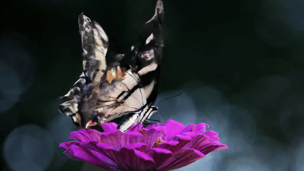
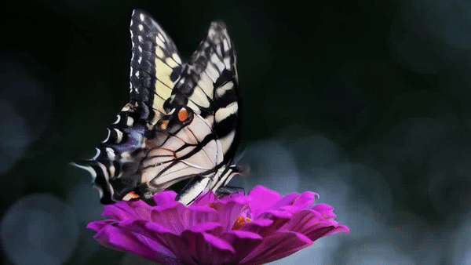
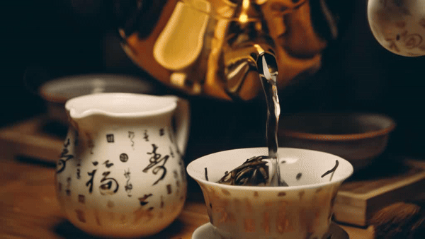
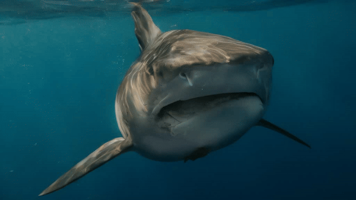
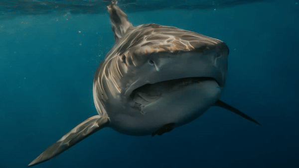

# VCUT Project

## Visual Results

### Input Images and Videos

<table>
  <tr>
    <th>Input Image</th>
    <th>Original Video</th>
    <th>Processed Video: SVD + VCUT</th>
  </tr>
  <tr>
    <td></td>
    <td></td>
    <td></td>
  </tr>
  <tr>
    <td></td>
    <td></td>
    <td></td>
  </tr>
  <tr>
    <td></td>
    <td></td>
    <td></td>
  </tr>
</table>

## Description
